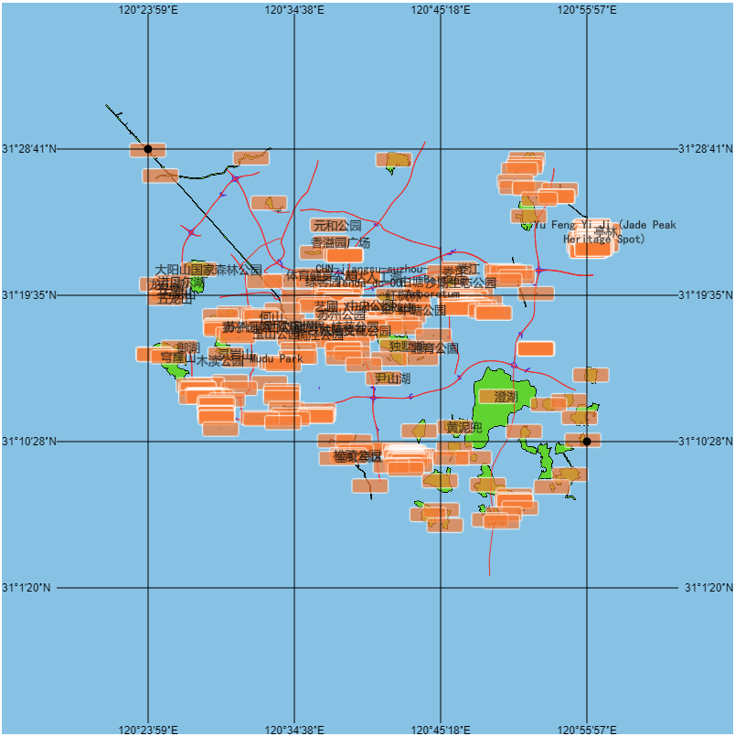

# Welcome to mapgrid 👋


> 地图格网生成工具，可以绘制在已有canvas或者导出图片等


## 如何使用

下载`dist`文件夹下的`mapgrid.js`文件，包含到项目中即可

## 文档
[参考文档](https://geocompass.github.io/mapgrid/out/index.html)
## 打包

```sh
npm run build
```

## 开发

```sh
npm install
npm run start
## 浏览器打开 
http://localhost:8099/test.html
```
## 计划

- [ ] 支持各种DPI
- [ ] 支持经纬度坐标系
- [ ] 支持多种样式的格网，例如 点、十字
- [ ] ……
## 作者

👤 **[MrSmallLiu](https://github.com/MrSmallLiu) QQ:1016817543**

👤 **[LOUSANPANG](https://github.com/LOUSANPANG)**

**期待各位的加入**

## Show your support

Give a ⭐️ if this project helped you!


